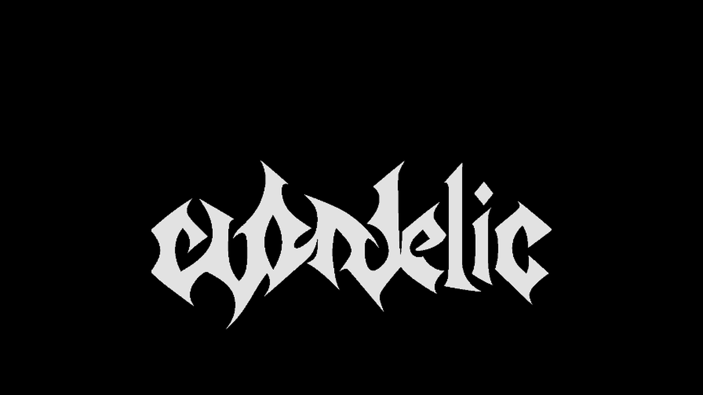
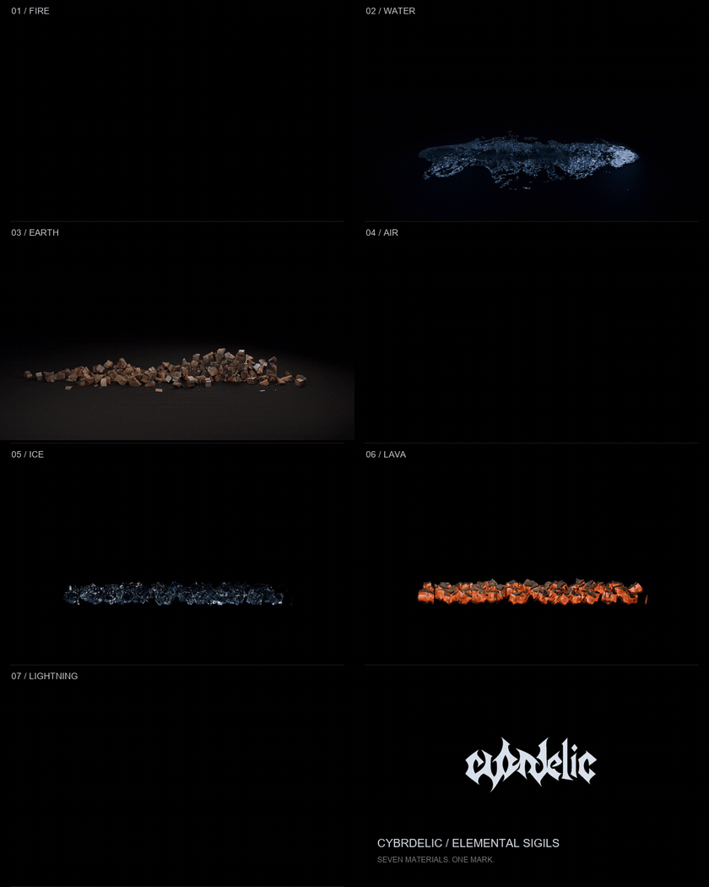
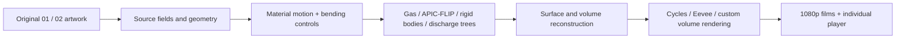

<p align="center">
  
</p>

<h1 align="center">CYBR / ELEMENTS</h1>

<p align="center"><strong>Seven materials. One mark.</strong><br>
Elemental motion, custom typography, and simulation-driven identity for Cybrdelic.</p>

<p align="center">
  <a href="#watch">Films</a> ·
  <a href="#run-it-locally">Run locally</a> ·
  <a href="#the-typefaces">Typefaces</a> ·
  <a href="docs/PIPELINES.md">Under the hood</a> ·
  <a href="https://github.com/cybrdelic/cybr-elements/releases/tag/v0.1.0">Complete asset release</a>
</p>



The same interlocked artwork becomes flame, suspended water, fractured stone,
smoke, ice, glowing basalt and electrical discharge. Each material has its own
motion, surface and ending. The surrounding world stays black; water and solids
meet a visible floor when the bending releases.

The GIF uses the actual delivered films. It is reduced to **10 fps** for the
README; the individual films below are **1920 × 1080 at 30 fps**. No audio.

## Watch

| Element | Motion and material | Film |
| :-- | :-- | :-- |
| **Fire** | A travelling ignition front, sustained fuel, rising flame and burnout | [Fire · 9.8 s](outputs/cybrdelic-type/elements/motion/bending/sigils/02/fire-02.mp4) |
| **Water** | Sag, delayed recovery, falling droplets, then a floor impact and spreading liquid | [Water · 11.2 s](outputs/cybrdelic-type/elements/motion/bending/sigils/02/water-02-r8.mp4) |
| **Earth** | Interlocking rock fragments, a suspended hold, then collision and settling | [Earth · 10 s](outputs/cybrdelic-type/elements/motion/bending/sigils/02/earth-02-r6.mp4) |
| **Air** | A turbulent smoke volume that curls through the mark and disperses | [Air · 9.8 s](outputs/cybrdelic-type/elements/motion/bending/sigils/02/air-02.mp4) |
| **Ice** | Transmissive blue fractures, cold mist and a collapsing pile | [Ice · 10 s](outputs/cybrdelic-type/elements/motion/bending/sigils/02/ice-02.mp4) |
| **Lava** | Heavy basalt crust, incandescent seams, smoke and solid fragments | [Lava · 10 s](outputs/cybrdelic-type/elements/motion/bending/sigils/02/lava-02.mp4) |
| **Lightning** | Branching 3D discharge trees and irregular pulses illuminating a moving gas volume | [Lightning · 10 s](outputs/cybrdelic-type/elements/motion/bending/sigils/02/lightning-02-r5.mp4) |

The local **02 player** switches between all seven films, downloads each one,
compares the underlying artwork, and retains the previous water, earth and
lightning versions. GitHub may show a download button for MP4s; the local player
provides continuous playback.

## Run it locally

The current seven films, player, posters and fonts are included in the checkout.
Viewing them needs **Python 3**, a browser, and no GPU or npm install.

```sh
git clone https://github.com/cybrdelic/cybr-elements.git
cd cybr-elements
python -m http.server 8767 --bind 127.0.0.1 --directory outputs/cybrdelic-type
```

Open **[the 02 player](http://127.0.0.1:8767/elements/motion/bending/sigils/02/)**.
The [font specimen](http://127.0.0.1:8767/typefaces/) also works immediately.

### Restore the complete project assets

The full historical gallery contains hundreds of renders and cached browser
meshes. These larger assets are published in the
[versioned release](https://github.com/cybrdelic/cybr-elements/releases/tag/v0.1.0)
instead of inflating Git history. The downloader restores original paths,
verifies SHA-256, skips matching files, and refuses to overwrite changed files.

```sh
# All historical galleries, films, browser meshes and downloadable design packs
python scripts/fetch_assets.py --site

# Also restore research inputs, geometry, textures and retained simulation states
python scripts/fetch_assets.py --all
```

Allow several GB of free disk space for the complete archive. You do not need
these downloads for the current 02 player. Per-frame working renders, compiled
caches and raw solver checkpoints are intentionally excluded; the source that
produces them is included. [Publication scope](docs/publication-scope.json) and
[the asset manifest](docs/assets.json) list the exact contents.

## The typefaces

Two custom display families extend the original wordmarks into usable fonts:

- **Cybrdelic Sigil / 01** — hooked, tapered, flowing forms.
- **Cybrdelic Cut / 02** — angular forms, diamond cuts and pointed terminals.

Both include **TTF + WOFF2**, uppercase, lowercase, figures, punctuation and
Latin accents. Enable discretionary ligatures to turn lowercase `cybrdelic`
into the complete wordmark, or insert **U+E000**. These are single-weight display
faces for identity and artwork, rather than body-text families.

[Font files](outputs/cybrdelic-type/typefaces/fonts/) ·
[Usage and coverage](outputs/cybrdelic-type/typefaces/README.md) ·
[SVG masters](outputs/cybrdelic-type/typefaces/vector/)

## Under the hood

This repository combines custom source fields, fluid and gas calculations,
rigid bodies, authored bending controls, and material-specific rendering.



Water uses the native **APIC/FLIP** solver and reconstructed liquid surfaces.
Earth, ice and lava use rigid fragments with **Bullet** collisions after release.
Gas is advected in 3D; electricity uses branching channel geometry coupled to
cloud lighting. Blender **Cycles** handles the current water, ice and lava
surface rendering; the current electrical volume is rendered with **Eevee**.

The bending is art-directed. The latest water film joins an existing opening
to a new forward-simulated hold and release. Ice and lava are fractured material
effects, not calibrated freezing or molten-rock phase-change solvers. The
electrical channels are a visual discharge model, not a plasma simulation.
[Pipeline details and rebuild notes](docs/PIPELINES.md) distinguish these parts.

## Project map

| Path | Contents |
| :-- | :-- |
| [`outputs/cybrdelic-type/`](outputs/cybrdelic-type/) | Static site, design studies, font guide and all element galleries |
| [`outputs/cybrdelic-type/elements/motion/bending/sigils/02/`](outputs/cybrdelic-type/elements/motion/bending/sigils/02/) | Current seven-element player and full-resolution films |
| [`outputs/cybrdelic-fonts/`](outputs/cybrdelic-fonts/) | Font handoff, outlines and build sources |
| [`work/element-motion/`](work/element-motion/) | Simulation, material, reconstruction and rendering scripts, including earlier experiments |
| [`work/flip-lettering/vendor/`](work/flip-lettering/vendor/) | Vendored native FLIP implementation and reconstruction tools |
| [`work/brand-font/`](work/brand-font/) | Typeface construction and validation tools |
| [`scripts/`](scripts/) | Asset restoration, CPU GIF assembly and publication tooling |
| [`docs/`](docs/) | Showcase, pipeline notes, attribution and asset inventory |

Earlier material and solver studies remain available as research history.
The current delivery is the **02 player** above; older gallery entries are not
claims of equivalent visual quality or physical accuracy.

## Verification

The four newest films were decoded completely (**1,236 frames**), visually
reviewed, and checked for playback in the local player. Their receipts include
resolution, timing and SHA-256. Existing fire, air and earth clips were preserved.

[Completion record](work/element-motion/sigil-02-active-elements/completion.json) ·
[Playback checks](work/element-motion/sigil-02-active-elements/browser-verification.json) ·
[Water physics audit](work/element-motion/sigil-02-active-elements/water-full/physics-audit.json)

To regenerate only the README showcase, with FFmpeg and Pillow installed:

```sh
python scripts/build_showcase.py
```

This assembles existing films on the CPU and does not start a simulation or GPU render.

## License and credits

The repository retains its existing [GNU GPL v2 license](LICENSE).
Bundled components retain their own notices. The basalt scans come from
**Poly Haven** under CC0; the original artists are credited in
[third-party notices](docs/THIRD_PARTY.md).

The bending vocabulary is inspired by *Avatar: The Last Airbender* and
*The Legend of Korra*. This is an independent Cybrdelic visual project.
