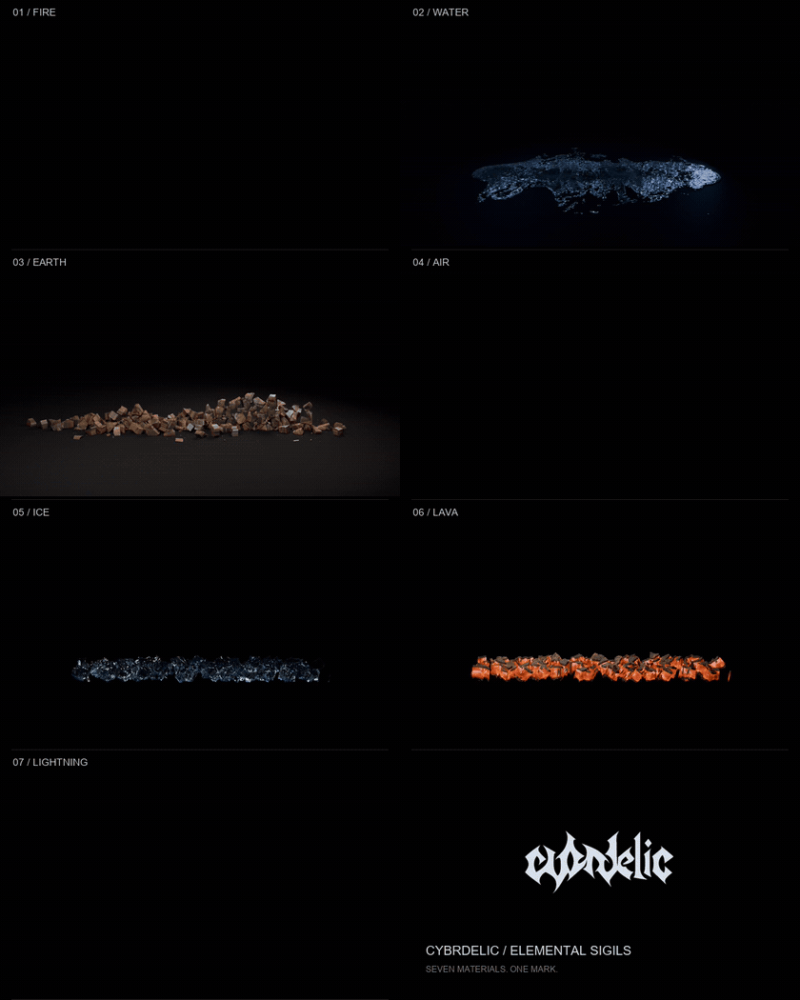
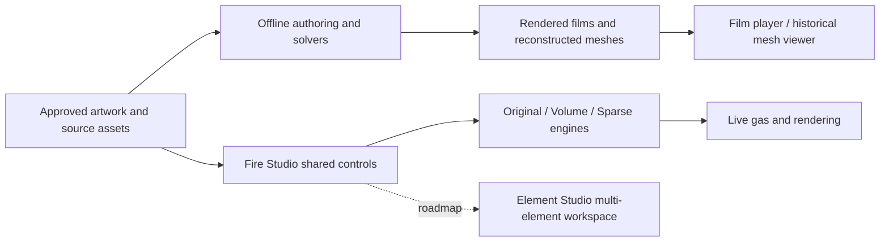

# CYBR ELEMENTS

Offline elemental rendering and interactive graphics for Cybrdelic. The current
interactive workspace is **Fire Studio**. The long-term multi-element workspace
is **Element Studio**; it is a roadmap, not a renamed or completed application.



The existing GIF shows seven offline films. The current local player includes
the eighth, Telekinesis, with its latest and previous revisions. These films are
rendered outputs; Fire Studio evolves and renders its gas state live.

## Start locally

The checked-in films, fonts, player and Fire Studio assets need no asset download.
Use Python 3.12+ and a current desktop browser:

```sh
python -m http.server 8776 --bind 127.0.0.1 --directory outputs/cybrdelic-type
```

- [Project launcher](http://127.0.0.1:8776/launch/)
- [Fire Studio](http://127.0.0.1:8776/elements/motion/bending/sigils/02/fire-live/)
- [Eight-element film player](http://127.0.0.1:8776/elements/motion/bending/sigils/02/)
- [Typeface specimen](http://127.0.0.1:8776/typefaces/)

Fire Studio Original requires WebGL 2 and floating-point targets. Volume and
Sparse require WebGPU and sufficient GPU memory. Open the server URL, rather
than opening HTML files directly. The historical hosted demo may lag this source;
these commands run the local consolidated version.

## Current capabilities

| Element | Offline source and delivered output | Interactive today |
| --- | --- | --- |
| Fire | Fuel/heat transport, combustion and volume rendering; 02 film | Fire Studio: Original, Volume and experimental Sparse |
| Air / smoke | Advected gas and turbulent smoke; 02 film | Smoke presets in Fire Studio; a dedicated Air workspace is roadmap |
| Water | Native APIC/FLIP, liquid reconstruction and Cycles optics; 02 film | Historical mesh-cache playback; archived meshes must be restored |
| Earth | Guided assembly, rigid fragments and floor collisions; 02 film | Element Studio roadmap |
| Ice | Rigid fractures, optical material and cold atmosphere; 02 film | Element Studio roadmap |
| Lava | Solid basalt fragments, incandescent seams and gas; 02 film | Element Studio roadmap |
| Lightning | Branching discharge geometry, authored pulses and lit gas; 02 film | Element Studio roadmap |
| Telekinesis | Authored assembly/cast of the approved fractured mark; 02 film, r4 and r3 | Element Studio roadmap |

Fire Studio includes source/preset selection, 24 authored fire abilities, finite
floor fuel, wood sources, lighting, camera controls, pause/restart, presentation,
saved looks and shared settings. Each engine retains its existing equations and
rendering. Original free fire now shares the established plume inlet and flow
treatment. This intentional owner change and its captured source boundary are
recorded in [validation](docs/VALIDATION.md). Experiments remain explicitly labeled.
Original free fire and fireball now convert ambient curl and planar swirl into
the same world units as their source momentum. The scoped correction retains
the inlet, heat, fuel, damping and cast timing; [actual before/after evidence](docs/VALIDATION.md#original-motion-unit-correction)
records its effect and validation limits.
Original free fire and fireball also limit exceptional confinement-force peaks,
while retaining weaker eddies and cast timing. This is a modest motion mitigation;
[matched native-age evidence](docs/VALIDATION.md#original-peak-force-mitigation)
records its effect without claiming every motion or appearance concern is solved.
Original coarse pressure now uses compatible boundary gradients and aligned fine-grid sampling.
This scoped correction retains existing sources, chemistry and rendering;
[fine residuals and validation limits](docs/VALIDATION.md#original-compatible-pressure-boundary-and-sampling)
remain explicit.
[Fire Studio guide](outputs/cybrdelic-type/elements/motion/bending/sigils/02/fire-live/README.md).

Offline renderers remain first-class authoring workflows under `work/`, with the
native FLIP source and its license retained. [Supported workflows and source scope](docs/OFFLINE_WORKFLOWS.md).
[Install and rebuild](docs/PIPELINES.md).
The water browser viewer displays reconstructed cached meshes; it does not evolve
water live. Existing offline films need no simulation or GPU to play.

## Scope and limitations

This publishes an inspectable graphics project, not a production physics claim.
Thermal/source behavior, smooth or overbright power heads, refined-flow fallback,
smoke-heavy performance and mobile acceptance remain limitations. Sparse retains
dense backing and has no established general speed advantage. No solver rewrite,
quality reduction or deployment is part of this consolidation.

[Known issues](docs/KNOWN_ISSUES.md) separates these limits from validation status.
Tests and package checks do not establish live appearance or performance.


```mermaid
flowchart LR
    A[Approved artwork and source assets] --> B[Offline authoring and solvers]
    B --> C[Rendered films and reconstructed meshes]
    C --> D[Film player / historical mesh viewer]
    A --> E[Fire Studio shared controls]
    E --> F[Original / Volume / Sparse engines]
    F --> G[Live gas and rendering]
    E -. roadmap .-> H[Element Studio multi-element workspace]
```

## Checks and packaging

Node.js 22+ runs the retained CPU regression suites. The following commands do
not start a browser or initialize a native GPU adapter:

```sh
node tools/check-cpu.mjs
python tools/fire-studio/package.test.py
python tools/fire-studio/package.py --check
python scripts/test_asset_tools.py
```

For a local standalone Fire Studio package, choose a new output name:

```sh
python tools/fire-studio/package.py --out releases/fire-studio-local
python tools/fire-studio/package.py --verify releases/fire-studio-local
```

The builder refuses to replace an existing package. Browser/GPU checks require
a separate coordinated run; see [validation](docs/VALIDATION.md). Packaging is a
local build and does not deploy or publish anything.

## Historical assets and source layout

Some historical gallery/mesh inputs were absent before consolidation. Their
versioned manifest and restoration script are retained:

```sh
python scripts/fetch_assets.py --all
```

The 50 v0.1.0 release packs were checked against GitHub's reported SHA-256, sizes
and URLs. Restoration requires network access, verifies downloaded bytes and
refuses to replace differing files. It is optional for the current films and
Fire Studio. [Historical archive](https://github.com/cybrdelic/cybr-elements/releases/tag/v0.1.0).

| Location | Purpose |
| --- | --- |
| `outputs/cybrdelic-type/launch/` | Local umbrella entrypoint |
| `outputs/.../sigils/02/fire-live/` | Existing Fire Studio runtime and native assets |
| `outputs/.../sigils/02/` | Delivered eight-element films, posters and player |
| `work/element-motion/` | Offline source preparation, simulation and render workflows |
| `work/flip-lettering/vendor/` | Retained native FLIP implementation |
| `tools/fire-studio/`, `tools/fire-browser/` | Useful regression, packaging and real browser checks |
| `docs/`, `scripts/` | Current guides, licenses and asset restoration |

Accumulated diagnostics, logs, obsolete probes and duplicate iteration archives
remain in the verified recovery backup and originals. They are excluded from
the staged tree. This organization makes the project easier to inspect; it does
not claim a rendering speedup.

## License

The existing [GNU GPL v2 license](LICENSE) is preserved. Component notices and
Poly Haven CC0 attribution remain in [third-party notices](docs/THIRD_PARTY.md).
Custom typefaces and approved artwork remain project assets. This independent
project draws its bending vocabulary from *Avatar* and *The Legend of Korra*.
