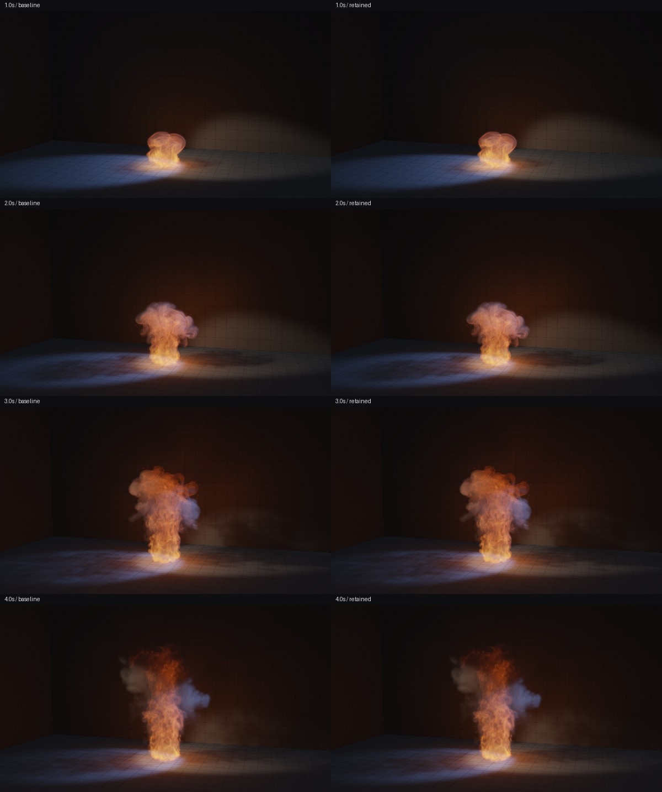

# Volume performance improvements — September 30, 2026

Release rc.9 reduces measured native completed-frame cost while preserving the tested fire and soot trajectory. The live browser and physical mobile performance gates remain open.

## Retained changes

**Reuse velocity trace results.** The predictor already computes the forward traces needed by the corrector's donor limiter. When the three faces share a donor box, its unused alpha channel stores an exact integer code from 1 to 64. Correction shares eight corner reads across XYZ and retains the independent reverse traces. Different boxes, out-of-range offsets and coordinates near integer boundaries use the original path. A scale-aware margin of `8 * float32 epsilon * max(abs(coordinate), 1)` prevents the observed rounding ambiguity. Corrected alpha remains expansion; no resources are added.

**Skip proven-zero shadow samples.** The existing visibility mask includes a full brick halo around chemistry. A zero mask entry proves the shadow sample has no chemical extinction. Keep all twelve sample positions and solid/mesh occlusion, and bind the same mask in the room and bounce passes. The simulation grids, chemistry, CFL rule, pressure iterations, room resolution, ray steps and presentation resolution are unchanged.

## Measurements

These are native Vulkan measurements on this laptop. They are not browser FPS. Intel UHD timestamps use the measured native queue period of 52.083332 ns; RTX timestamps use 1 ns. Older native Intel logs which divide raw ticks by one million must not be read as milliseconds without their period.

| Paired cost | Intel UHD bonfire | Intel UHD oil burst | RTX 4060 Laptop bonfire |
| --- | ---: | ---: | ---: |
| Predictor plus velocity correction | 5.73% lower | 10.24% lower | 7.45% lower |

Held states and six boundary/CFL cases compare every predictor XYZ and corrected velocity component. The guarded candidate has no numerical differences in those tests. A baseline-evolving bonfire checks all 302 substeps over four seconds without a differing component.

Lighting GPU cost falls 51–67% for bonfire, 50–64% for oil burst and 26–51% for the CYBR sigil across front, oblique, smoke-inspection and fire-only views. All fifteen render pairs retain the same chemical field. Differences affect at most thirteen pixels per view, by at most one channel level of 255. The contact sheets were inspected individually.

### Complete scene

Two baseline and two retained replays each evolve four seconds / 240 frames of continuous bonfire, studio lighting, 128³ velocity, 256³ chemistry and 768 × 432 output. The table averages the run summaries after the first simulated second.

| Completed native frame cost | Baseline | Retained | Reduction |
| --- | ---: | ---: | ---: |
| Median | 35.50 ms | 27.51 ms | 22.5% |
| p95 | 72.73 ms | 63.02 ms | 13.3% |

All four final chemistry byte hashes match. Every frame's maximum speed and CFL substep count also match, with 302 total steps. Eleven matched fire, smoke and angle captures differ by at most 1/255; the maximum mean channel difference is 0.0000121/255. The motion comparison below was inspected directly.

The [measurement record](evidence/volume-speed-2026-09-30.json) contains calibrated timings, adapter details, field hashes, pixel comparisons and boundary-case results. Full traces, actual WGSL exports and rejected experiments remain under `work/volume-speed-qa/` locally.

## Regression checks and rejected changes

60 Node checks and six package tests pass. The new lighting fixture executes actual frame/render methods through normal/tree transitions, confirms mask ordering and resource bindings, and checks paused caching and room-off behavior. Package validation runs it against source and deployment copies. Native compilation and actual bind-group creation pass for twelve normal/tree lighting/render pipelines.

Reject the unguarded donor cache: a near-grid coordinate produced one half-float ULP of error which later changed the trajectory. The guard removes that observed error. Other rejected candidates include shared-memory three-pass pressure smoothing (6.65× slower despite matching fields), degree-two Chebyshev smoothing (worse residuals), cold scalar branching, and velocity trace/noise rewrites without a reliable gain.

Dense velocity and pressure still dominate simulation cost. These short native runs do not establish sustained browser frame pacing, Original parity, a 60 FPS guarantee or mobile support. No quality reduction was used to obtain the retained measurements.
