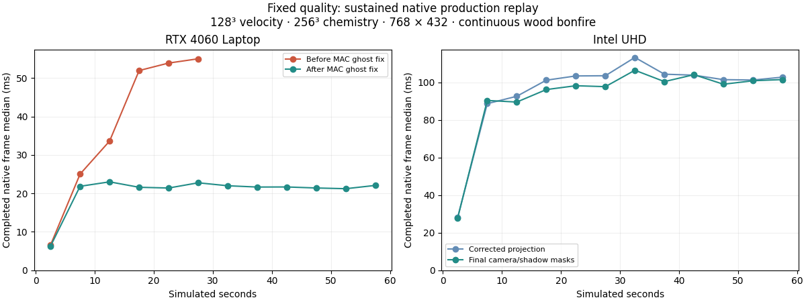
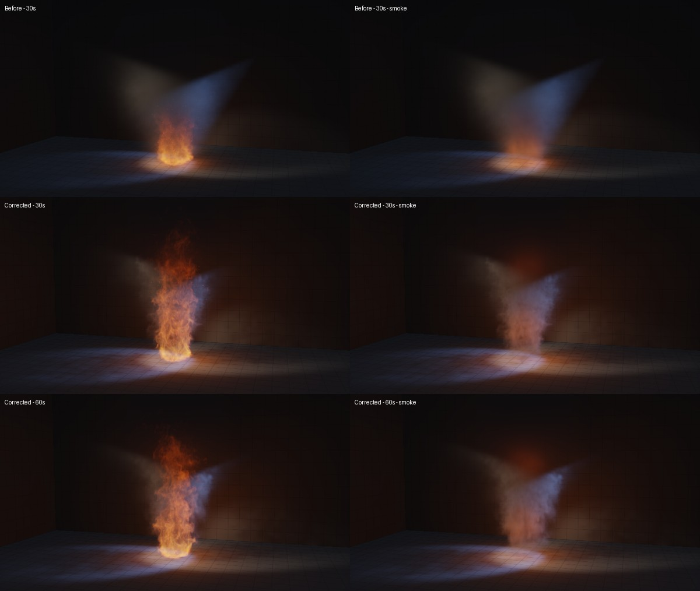

# Volume sustained-run recovery — rc.10

The September 30 investigation reproduced the reported loss of detail and growing frame cost. The retained fix corrects velocity at packed grid borders. A separate optical mask reduces lighting work without changing the transported chemistry or tested pixels. There is no automatic resolution or quality reduction.

## Cause and correction

The MAC grid packs three staggered face components into a `(N+1)³` texture. Each component has a different valid domain: X has `x=0..N` and `y,z=0..N−1`, with corresponding permutations for Y and Z. The old pressure projection updated every component everywhere, including invalid tangential padding. Those padding values could grow in empty air, contaminate filtered velocity near the border and inflate the maximum speed used to choose CFL substeps.

An Intel replay at 10 simulated seconds found the speed maximum at `z=N`, where its X/Y components were invalid padding and local chemistry was zero. Reported speed was 5.649; the peak over valid faces was 4.298. Longer runs acquired more substeps and lost the established flame shape.

Projection now derives each padded tangential component from its nearest valid face's preprojection velocity and pressure, in the same pass. Valid face equations, normal boundary faces, floor velocity, expansion, pressure iterations and source behavior remain unchanged. A native N16 test with varying pressure on every boundary verified 13,056 valid face components bit-for-bit, 1,683 padding components equal to their nearest projected valid faces, unchanged expansion, zero floor-normal velocity and finite output. The corrected flow intentionally differs from the faulty full simulation.

## Rendering support

Transport still retains soot, heat, fuel and oxygen deficit. Two optical buffers add 256 KiB and follow chemistry ping-pong. Camera/light support uses conservative margins below the renderer's existing discard thresholds; shadow support retains **every positive soot cell**. Workgroups atomically OR both flags and the existing one-brick dilation preserves interpolation support. Reset clears both buffers.

The final mask refinement and its preceding corrected projection run produced the same final chemistry SHA, identical speed/substep values on all 3,600 frames, and identical pixels in 29 matched captures. Held-state RTX comparisons additionally matched all RGBA components in 20 front, side, smoke and fire-only views of bonfire, oil burst and CYBR sigil. Dead or invisible embers also return before unnecessary occlusion sampling.

## Measured result

These are completed **native Vulkan offscreen submissions**, not browser FPS. Conditions: 128³ velocity, 256³ chemistry, 768×432 output, wood bonfire continuously fueled for 60 simulated seconds, studio lighting, 1/60 step and unchanged CFL/pressure/ray settings. Capture and full-field diagnostics were outside timed frames. Native timestamp periods were calibrated on each adapter.

| Comparison | Completed native frame cost |
| --- | ---: |
| RTX 4060 Laptop, faulty projection, 20–30 s average of five-second window medians | 54.45 ms |
| RTX, corrected projection, same interval | 22.06 ms — 59.5% lower |
| RTX, corrected projection, 20–60 s window medians | 21.2–22.7 ms |
| Intel UHD, final split-mask build, whole-minute median / p95 | 100.45 / 158.94 ms |

The large reduction comes from correcting border velocity and avoiding its runaway CFL cost. The mask refinement offers a smaller gain: held late-bonfire RTX front lighting was 5.796 → 5.691 ms. Its Intel whole-run median improved modestly and p95 did not improve. It is not a large independent speedup.

Plume growth still increases work during warm-up, then the corrected runs settle instead of progressively adding substeps. The minute captures retain flame tongues and smoke detail. Open-boundary and confinement-weighting trials were rejected and are not shipped.

## Verification and remaining limits

The Node regression suite passes 65 tests. Six package tests and six automatic runtime fixtures cover startup, transitions, reset, lighting, optical ordering and sustained scheduling. The scheduling fixture exercises 10,000 display ticks with bounded submissions, telemetry slots, bind-group caches and trace size; it is not a physical flow or FPS test. The package verifies shipped bytes and dependencies separately.

Intel remains far below 60 FPS or Original parity. Live-browser sustained pacing and physical mobile performance remain unverified; native capture cannot establish either. Sixty simulated seconds is the measured duration, not an indefinite stability guarantee. Offline film detail parity and physical object fracture/collapse remain open.

The compact [evidence record](evidence/volume-sustained-2026-09-30.json) contains adapter identities, window costs, shader/field hashes, projection proof and paired pixel results. Full traces and native reproduction tools remain in `work/volume-speed-qa/`; source exports are in `work/burning-sources-qa/`.
